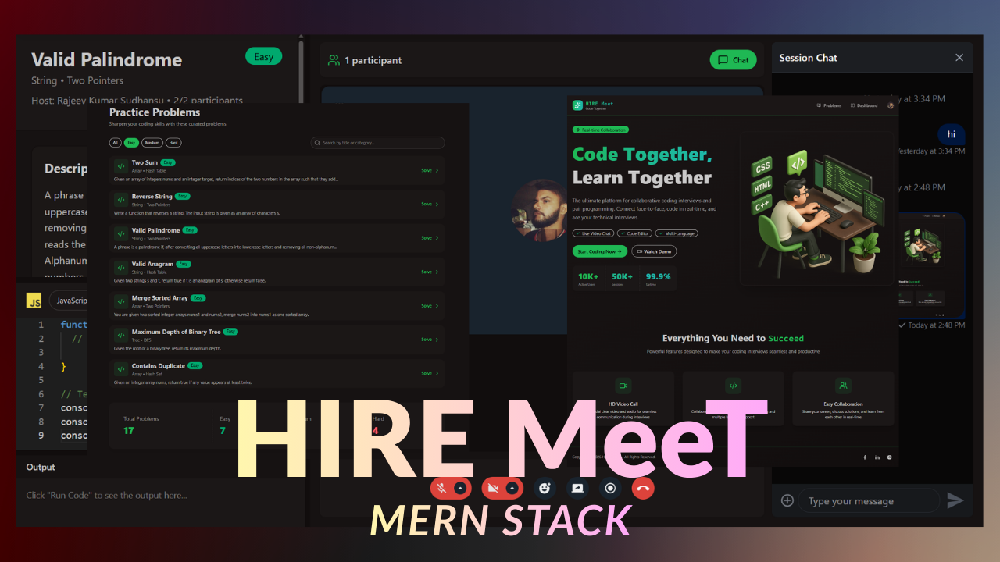

<div align="center">
    <h1>HIRE Meet</h1>

This application is deployed on Vercel. Please check it out [here](https://hiremeett.vercel.app/).



</div>

## Introduction

A full-stack technical interview platform designed to simulate real-world coding interviews with real-time collaboration, video communication, and automated evaluation.
Built using the MERN stack, this platform enables candidates and interviewers to interact seamlessly through integrated video calling, shared code editing, chat, and live code execution.

The goal of this project was to recreate a modern interview experience similar to platforms used by tech companies — while ensuring scalability, performance, and security through isolated execution environments and background task processing.

## 🖥️ Tech Stack

**Frontend:**

&nbsp;
&nbsp;

&nbsp;

&nbsp;

&nbsp;

**Backend:**


&nbsp;

&nbsp;

&nbsp;

&nbsp;

&nbsp;

&nbsp;

**Deployed On:**


&nbsp;

## 🚀 Key Features

### 🧑‍💻 Collaborative Coding

- VSCode-style embedded code editor
- Multi-language support
- Practice mode for solo problem solving
- Auto-evaluation against test cases
- Success/Fail feedback with visual notifications
- Celebration effects on passing solutions 🎉

### 🎥 Real-Time Interview Rooms

- 1-on-1 video interview sessions
- Microphone & camera controls
- Screen sharing support
- Session recording capability
- Room locking to restrict participants
- Designed for low-latency communication

### 💬 Live Messaging

- Real-time chat during interviews
- Instant message updates
- Seamless candidate/interviewer interaction

### ⚙️ Secure Code Execution

- Sandboxed execution environment
- Isolated runtime for safety
- Prevents malicious code impact
- Automated result validation

### 🧭 Dashboard & Analytics

- Interview activity statistics
- Usage insights
- Live session tracking

### 🔐 Authentication & Security

- Clerk-based authentication
- Protected routes
- Session-based access control

### 🧠 Background Processing

- Async job handling using Inngest
- Efficient offloading of heavy tasks
- Improves responsiveness and scalability

### ⚡ Performance Optimization

- Data fetching with TanStack Query
- Intelligent caching
- Reduced redundant network calls

## Installation

1. **Clone the repository**:

   ```sh
   git clone https://github.com/rajeevkrS/Video-Calling-Interview-App
   ```

2. **Install dependencies in admin, backend and frontend**:

   ```sh
   cd backend
   npm install

   cd frontend
   npm install
   ```

3. **Set up environment `.env` variables**:

   ```dotenv
                        # BACKEND ENV GUIDE

   PORT= your port no.

   # mongodb database
   DB_URL= your mongodb url

   # inngest setup
   INNGEST_EVET_KEY= your inngest event key
   INNGEST_SIGNING_KEY= your inngest signing key

   # for stream setup
   STREAM_API_KEY = your stream api key
   STREAM_SECRET_KEY = your stream secret key

   # for clerk setup
   CLERK_PUBLISHABLE_KEY= your clerk publishable key
   CLERK_SECRET_KEY= your clerk secret key

   CLIENT_URL= your client/frontend url

                        # FRONTEND ENV GUIDE

   VITE_API_URL= your backend url
   VITE_CLERK_PUBLISHABLE_KEY= your clerk publishable key
   VITE_STREAM_API_KEY = your stream api key
   ```

4. **Run the application**:

   In the `backend` directory, start the server:

   ```sh
   npm run server
   ```

   In the `frontend` directory, start the Frontend React app:

   ```sh
   npm run dev
   ```

## 👤 Developer

[RAJEEV KUMAR SUDHANSU](https://github.com/rajeevkrS)

## 📬 Contact

If you want to contact me, you can reach me through below handles.

<a href="https://www.linkedin.com/in/rajeev-kumar-sudhansu-b52027326/" target="_blank"></a>

<a href="mailto:rajeevkumarr1221@gmail.com"></a>

## Contribution:

Feel free to contribute to the project by opening issues or creating pull requests. Your feedback and suggestions are highly appreciated.

### Show your support by Star 🌟 this repo!
